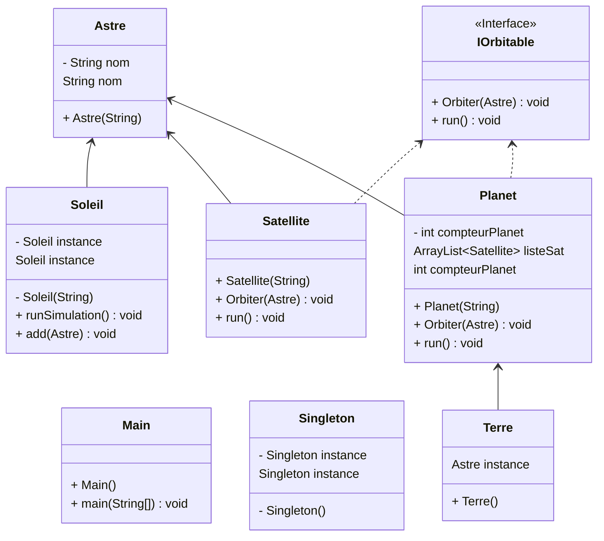

# ExempleSingleton1251

```mermaid
classDiagram

direction BT

class Astre {

  + Astre(String)

  - String nom

   String nom

}

class IOrbitable {

<<Interface>>

  + Orbiter(Astre) void

  + run() void

}

class Main {

  + Main()

  + main(String[]) void

}

class Planet {

  + Planet(String)

  - int compteurPlanet

  + Orbiter(Astre) void

  + run() void

   ArrayList~Satellite~ listeSat

   int compteurPlanet

}

class Satellite {

  + Satellite(String)

  + Orbiter(Astre) void

  + run() void

}

class Singleton {

  - Singleton()

  - Singleton instance

   Singleton instance

}

class Soleil {

  - Soleil(String)

  - Soleil instance

  + runSimulation() void

  + add(Astre) void

   Soleil instance

}

class Terre {

  + Terre()

   Astre instance

}


Planet  -->  Astre

Planet  ..>  IOrbitable

Satellite  -->  Astre

Satellite  ..>  IOrbitable

Soleil  -->  Astre

Terre  -->  Planet
```

